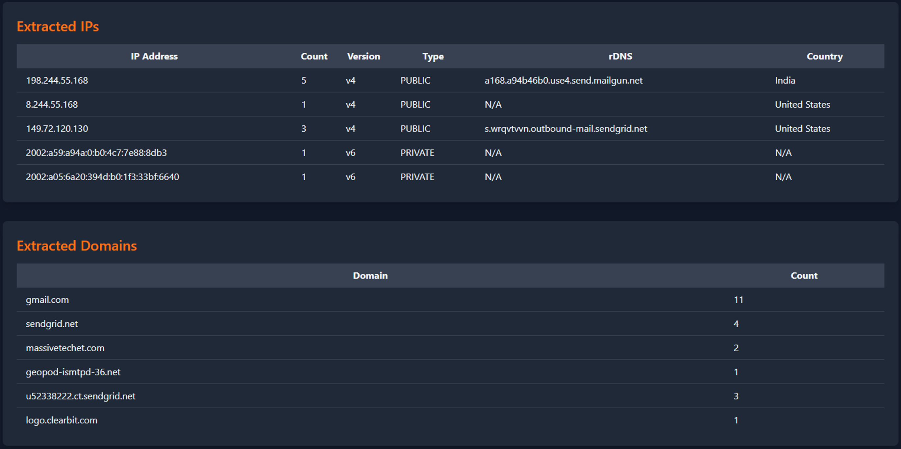

# Mail Header Analyzer

A lightweight Flask-based web application for parsing and visualizing email headers. Paste raw email headers into the web interface to get:

- **Summary** of key header fields (From, To, Subject, Date)
- **Authentication results** (SPF, DKIM, DMARC)
- **WHOIS info** for sender domain
- **Hop-by-hop delays** with an interactive bar chart
- **Extracted IP addresses** (with reverse DNS & GeoIP country lookups)
- **Extracted domains**
- **Extracted links** (with counts)

---

## Prerequisites

- Python 3.7+
- [GeoLite2 Country](https://dev.maxmind.com/geoip/geolite2-free-geolocation-data) database (you must register, download the `GeoLite2-Country.mmdb` database, and placev in `data/`)
- (Optional) A virtual environment tool (e.g. `venv` or `virtualenv`)

---

## Features

- **User friendly, responsive UI** with Tailwind CSS and Chart.js.
- **PDF / CSV / MD** export.

**Header parsing / Date/time parsing / WHOIS lookups**


**Hop Visualizer / Details & GeoIP Lookups**


**Extracts IP w/rDNS / Extracts Domains w/count**


**Extracts link text and link w/count**


---

## Usage

Run the app with default settings:

```bash
python3 mha.py
```
- Open your browser at [http://127.0.0.1:8080](http://127.0.0.1:8080).
- Paste your raw email headers into the textarea and click **Analyze**.
- Click **Export** to export data in different formats.
---

## Build with Pyinstaller
  
   ```bash
pyinstaller --onefile --add-data "data;data"  --add-data "$(python3 -c 'import whois, os; print(os.path.join(os.path.dirname(whois.__file__), \"data\"))'):whois/data" mha.py
   ```
---


### Command-Line Options

- `-d, --debug`  
  Enable Flask debug mode (automatic reloader & detailed errors).

- `-b BIND_ADDRESS, --bind BIND_ADDRESS`  
  Bind address (default: `127.0.0.1`).

- `-p PORT, --port PORT`  
  Port number (default: `8080`).

Example:

```bash
python3 mha.py -d -b 0.0.0.0 -p 5000
```

---

## Configuration

- **`MMDB_PATH`**  
  Path to the GeoLite2 database (default: `data/GeoLite2-Country.mmdb`).  
  You can override by editing the constant in `mha.py` before running.

- **Static assets**  
  - Tailwind CSS and Chart.js are served from `data/` via Flask’s `static` folder.  
  - Replace `data/tailwinds.16` or `data/chart.js` with newer versions if needed.

---

## Project Structure

```
.
├── data/
│   ├── GeoLite2-Country.mmdb
│   ├── tailwinds.16
│   └── chart.js
├── docs/
│   └── screenshot.png
├── mha.py
├── requirements.txt
└── README.md
```

- **`mhar.py`** – Main application script.
- **`data/`** – Static assets & GeoIP database.
- **`docs/`** – Documentation images & examples.
- **`requirements.txt`** – Python dependencies.

---

## Contributing

1. Fork the repository.  
2. Create a feature branch: `git checkout -b feature/YourFeature`.  
3. Commit your changes: `git commit -m "Add YourFeature"`.  
4. Push to the branch: `git push origin feature/YourFeature`.  
5. Open a pull request.

Please ensure your code follows PEP 8 and includes appropriate tests or usage examples.

---

## License

This project is licensed under the GPL-3.0 license

---
